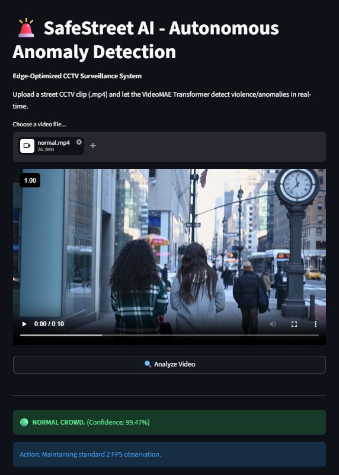
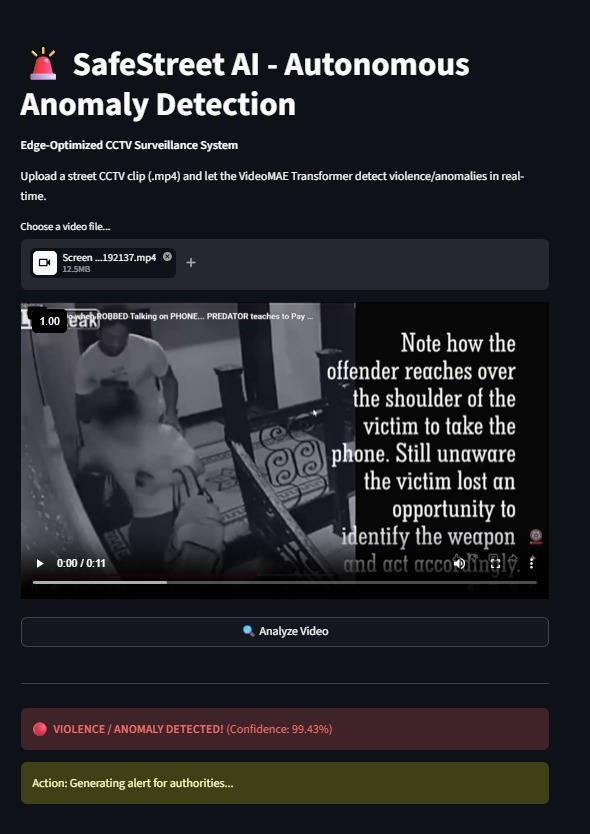

<div align="center">
  <h1>🚨 SafeStreet AI</h1>
  <p><b>Edge-Optimized Transformer for Real-Time CCTV Violence Detection</b></p>

  
  
  
  
</div>

---

## 📖 Overview

SafeStreet AI is an intelligent CCTV surveillance system that **detects violence automatically in real-time** using a Transformer-based architecture (VideoMAE).

Unlike traditional CCTV systems that only record, this system actively **analyzes motion over time** and triggers alerts instantly.

---

## ✨ Key Features

* 🧠 **Spatio-Temporal Understanding** (captures motion, not just objects)
* ⚖️ **Balanced Training (50-50 dataset)** to avoid bias
* ⚡ **3-Chunk Sampling (Memory Efficient)**
* 🎯 **Max-Pooling Decision Logic** for final alert

---

## 🏗️ System Architecture

### 🔹 Pipeline

1. Input video / CCTV stream
2. Divide into 3 chunks → Start / Middle / End
3. Extract 16 frames per chunk
4. Pass into VideoMAE model
5. Aggregate predictions using:

```python
torch.max(predictions)
```

---

## 📸 Demo

### 🔹 Normal Activity



### 🔹 Violence Detection



---

## 📂 Project Structure

```
SafeStreet-AI/
 ├── app.py
 ├── streetAi.ipynb
 ├── requirements.txt
 ├── images/
 │    ├── normal.png
 │    └── violence.png
 └── README.md
```

---

## 🚀 Setup Instructions

### 1. Clone Repo

```bash
git clone https://github.com/93527Rupali38898/SafeStreet-AI.git
cd SafeStreet-AI
```

### 2. Create Environment

```bash
python -m venv venv
venv\Scripts\activate      # Windows
source venv/bin/activate   # Mac/Linux
```

### 3. Install Dependencies

```bash
pip install -r requirements.txt
```

### 4. Download Model
👉 **[Download SafeStreet_VideoMAE.pth](https://drive.google.com/file/d/1numc2-YeqUj4lsU368oLc3VKxoWTNdUU/view)**

Place `.pth` file in root directory.

### 5. Run App

```bash
streamlit run app.py
```

---

## 🔮 Future Scope

* Edge deployment (Jetson Nano)
* Real-time streaming optimization
* RL-based smart surveillance
* Low-power AI systems

---

## 👩‍💻 Author

**Rupali Goyal**
🔗 https://github.com/93527Rupali38898

---

## ⭐ Why This Project Stands Out

* Real-world AI problem
* Efficient Transformer deployment
* System design + ML combination
* Industry-level optimization
